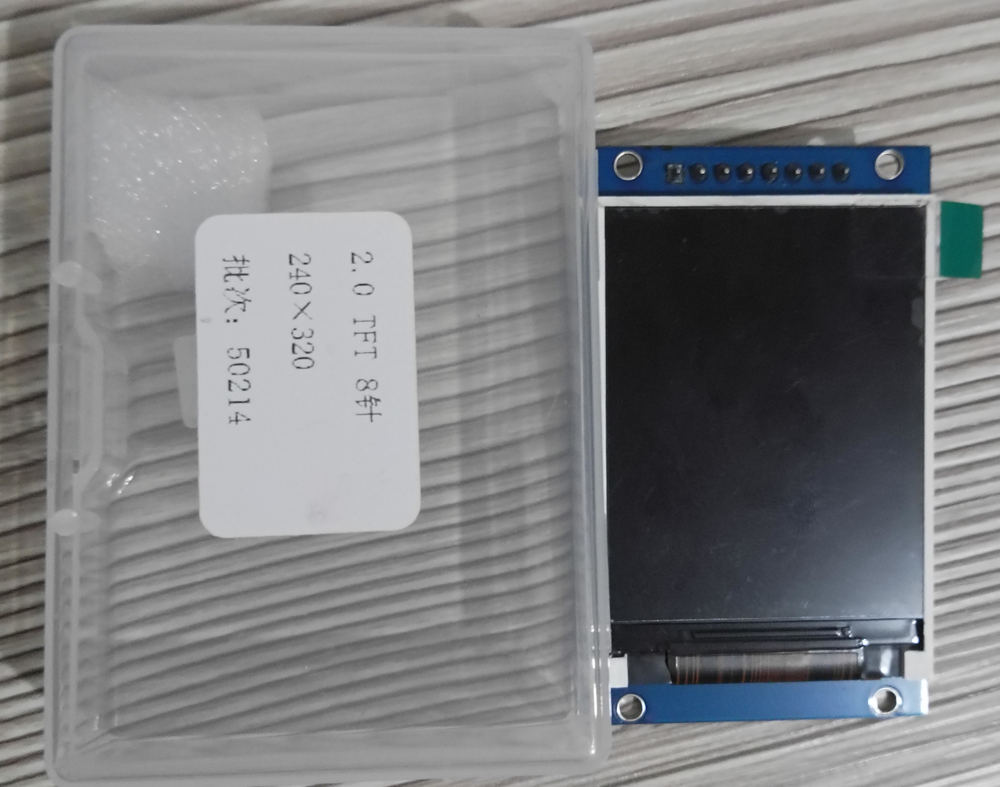
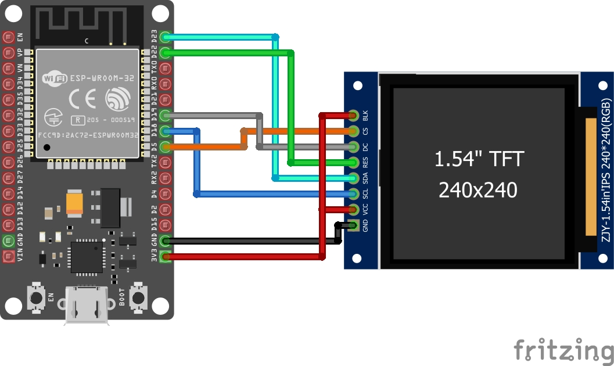

# 📘 ESP32 + TFT ST7789 (GMT020-02-8P VER 1.21)

This project demonstrates how to interface an **ESP32** with the
**OTFTSPI GMT020-02-8P VER:1.21** 2.0" TFT display using the **ST7789
driver**.\
The configuration uses the **TFT_eSPI** library with a customized setup
to ensure correct color rendering and proper font loading.
This is the TFT used:


## 🧩 Components Used

  | Component             | Model / Specification               |
  | --------------------- | ----------------------------------- |
  | **Microcontroller**   | ESP32 DevKit / Wemos Lolin32 Lite   |
  | **Display**           | OTFTSPI GMT020-02-8P VER:1.21       |
  | **Driver IC**         | ST7789                              |
  | **Screen Size**       | 2.0 inches                          |
  | **Resolution**        | 240 × 320 px                        |
  | **Interface**         | SPI                                 |
  | **Logic Voltage**     | 3.3V                                |
  | **Library**           | TFT_eSPI                            |

## 🔌 Wiring Diagram

The diagram is located at:

```
/docs/wiring_diagram.png
```


⚠️ *Although the image shows another TFT model, the wiring and pinout are identical for this project.*

---

| TFT Pin        | Description  | ESP32 Pin |
| -------------- | ------------ | --------- |
| **VCC**        | Power        | 3.3V      |
| **GND**        | Ground       | GND       |
| **SCL / SCLK** | SPI Clock    | **18**    |
| **SDA / MOSI** | SPI Data     | **23**    |
| **CS**         | Chip Select  | **5**     |
| **DC**         | Data/Command | **19**    |
| **RST / RES**  | Reset        | **22**    |
| **BLK / LED**  | Backlight    | 3.3V      |

> ⚠️ **Important:** The display works at **3.3V only**. Do not connect
> 5V.

## ⚙️ TFT_eSPI Configuration (`User_Setup.h`)

Below is the exact configuration used for this project:

``` cpp
#define ST7789_DRIVER
#define TFT_RGB_ORDER TFT_BGR

#define TFT_WIDTH  240
#define TFT_HEIGHT 320

// SPI Pins
#define TFT_MOSI 23
#define TFT_SCLK 18

// Control Pins
#define TFT_CS   5
#define TFT_DC   19
#define TFT_RST  22

// SPI Frequencies
#define SPI_FREQUENCY      27000000
#define SPI_READ_FREQUENCY 20000000

// Fonts (required for text rendering)
#define LOAD_GLCD
#define LOAD_FONT2
#define LOAD_FONT4
#define LOAD_FONT6
#define LOAD_FONT7
#define LOAD_FONT8
#define LOAD_GFXFF
#define SMOOTH_FONT
```

### Notes

-   `TFT_BGR` fixes reversed red/blue colors.\
-   Font loading is **required**; without it, text will not display.\
-   SPI may be increased up to 40 MHz depending on wiring quality.

## 📝 Example Code

This example displays simple text on the screen.

``` cpp
#include <Arduino.h>
#include <TFT_eSPI.h>

TFT_eSPI tft = TFT_eSPI();

void setup() {
  tft.init();
  tft.setRotation(1);
  tft.fillScreen(TFT_BLACK);

  tft.setTextColor(TFT_WHITE, TFT_BLACK);
  tft.setCursor(10, 30);
  tft.setTextSize(3);
  tft.println("ESP32 + ST7789");

  tft.setTextColor(TFT_GREEN);
  tft.setCursor(10, 80);
  tft.setTextSize(2);
  tft.println("Display OK!");
}

void loop() {}
```
## 📝 Author

Project created by **Edu Santander**  
For questions, improvements, or troubleshooting, feel free to open an issue.


